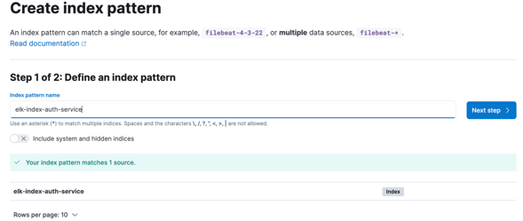
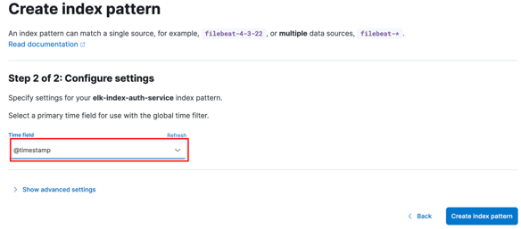
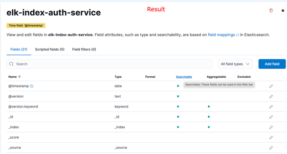
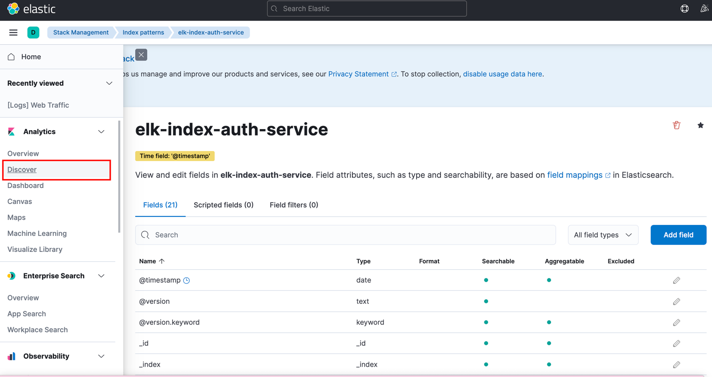
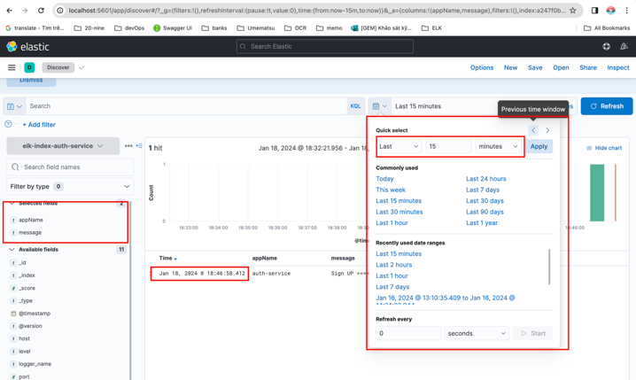

```text
  _____ _     _  __          __  __ _                                    _               
 | ____| |   | |/ /         |  \/  (_) ___ _ __ ___  ___  ___ _ ____   _(_) ___ ___  ___ 
 |  _| | |   | ' /   _____  | |\/| | |/ __| '__/ _ \/ __|/ _ \ '__\ \ / / |/ __/ _ \/ __|
 | |___| |___| . \  |_____| | |  | | | (__| | | (_) \__ \  __/ |   \ V /| | (_|  __/\__ \
 |_____|_____|_|\_\         |_|  |_|_|\___|_|  \___/|___/\___|_|    \_/ |_|\___\___||___/
```

### 1. Application
- Add dependency to `pom.xml`
```xml
<dependency>
    <groupId>net.logstash.logback</groupId>
    <artifactId>logstash-logback-encoder</artifactId>
    <version>6.6</version>
</dependency>
```

- Create file `logback-spring.xml` at folder `resources`

```xml
<?xml version="1.0" encoding="UTF-8"?>
<configuration>
    <include resource="org/springframework/boot/logging/logback/base.xml"/>
    <appender name="logstash" class="net.logstash.logback.appender.LogstashTcpSocketAppender">
        <!-- <destination>localhost:5600</destination>--> <!--local env-->
        <destination>${LOGSTASH_HOST:-localhost:5600}</destination> <!--docker env-->
        <encoder class="net.logstash.logback.encoder.LoggingEventCompositeJsonEncoder">
            <providers>
                <mdc/>
                <context/>
                <logLevel/>
                <loggerName/>
                <pattern>
                    <pattern>
                        {
                        "appName": "auth-service"
                        }
                    </pattern>
                </pattern>
                <threadName/>
                <message/>
                <logstashMarkers/>
                <stackTrace/>
            </providers>
        </encoder>
    </appender>
    <root level="info">
        <appender-ref ref="logstash"/>
    </root>
</configuration>
```

### 2. Set up ELK

-  Create file `logstash.conf` before run ELK

```logstash
input {
  tcp {
    # Socket port
    port => 5600
    codec => json
  }
}

output {
  elasticsearch {
    hosts => ["${XPACK_MONITORING_ELASTICSEARCH_HOSTS}"]
    index => "elk-index-%{appName}"
  }
}
```

- Create file `docker-compose.yml`

```yaml
version: '3.9'

services:

  auth-service:
    container_name: auth-service
    build:
      context: ./
      dockerfile: Dockerfile
    environment:
      - LOGSTASH_HOST=logstash:5600
    ports:
      - '8081:8081'
    depends_on:
      logstash:
        condition: service_started
  elastic-search:
    image: elasticsearch:7.14.1
    container_name: elasticsearch
    restart: always
    ports:
      - "9200:9200"
    environment:
      - discovery.type=single-node
  kibana:
    image: kibana:7.14.1
    container_name: kibana
    restart: always
    ports:
      - "5601:5601"
    environment:
      - ELASTICSEARCH_HOSTS=http://elastic-search:9200
  logstash:
    image: logstash:7.14.1
    container_name: logstash
    restart: always
    ports:
      - "5600:5600" # Socket port
      - "5044:5044"
#      - "9600:9600"
    volumes:
      - ./logstash.conf:/usr/share/logstash/pipeline/logstash.conf
    environment:
      - XPACK_MONITORING_ELASTICSEARCH_HOSTS=http://elastic-search:9200
      - XPACK_MONITORING_ENABLED=true

networks:
  default:
    name: auth-network
```

### 3. Check & Visualize Log

- Check [Elasticsearch](http://localhost:9200/_cat/indices)
```text
green  open .geoip_databases                WgNidAGeT1-_PGJIT7ieWg 1 0 42   0 39.3mb 39.3mb
green  open .kibana_task_manager_7.14.1_001 bb_UHjklTQqf9TG8Z9Li3Q 1 0 14 324  104kb  104kb
green  open .apm-custom-link                k57CHTTlQY-b5t8NxsE6pw 1 0  0   0   208b   208b
yellow open elk-index-auth-service          vYWglzkwSsSAvfIuSX43sw 1 1 11   0   39kb   39kb --> It's here
green  open .apm-agent-configuration        RgQJERfdQhmeGymPRc1Baw 1 0  0   0   208b   208b
green  open .kibana_7.14.1_001              2N-aKyguTb-omULBTFL2yQ 1 0 12   0  2.1mb  2.1mb
green  open .kibana-event-log-7.14.1-000001 fEexxfBdSN-EHOHGhjkV2A 1 0  1   0  5.5kb  5.5kb
```

- Create [index pattern](http://localhost:5601/app/management/kibana/indexPatterns)

  

  

  


- View Log
  
  

  
