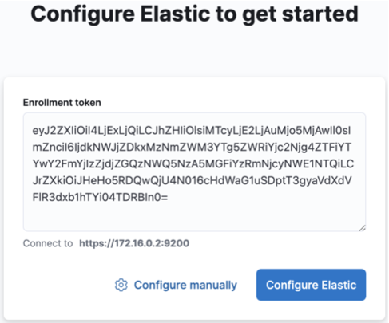
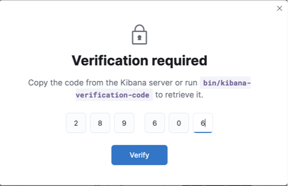

```text
888    d8P  d8b 888                                 
888   d8P   Y8P 888                                 
888  d8P        888                                 
888d88K     888 88888b.   8888b.  88888b.   8888b.  
8888888b    888 888 "88b     "88b 888 "88b     "88b 
888  Y88b   888 888  888 .d888888 888  888 .d888888 
888   Y88b  888 888 d88P 888  888 888  888 888  888 
888    Y88b 888 88888P"  "Y888888 888  888 "Y888888
```
-- 

### 1. Install Kibana on MacOS
- [Download Kibana](https://www.elastic.co/downloads/kibana)

```bash
$ wget https://artifacts.elastic.co/downloads/kibana/kibana-8.11.4-darwin-x86_64.tar.gz
```

- Unzip file `kibana-8.11.4-darwin-x86_64.tar.gz`
```bash
  $ tar -xzf kibana-8.11.4-darwin-x86_64.tar.gz
```

- Run Kibana
```bash
  $ cd kibana-8.11.4
  $ bin/kibana
```

- Check status on log
    ```
    Kibana has not been configured.

    Go to http://localhost:5601/?code=289606 to get started.
    ```

- Configure Elastic to get started

    Copy enrollment token from elastic and paste Kibana

    

- Verification required
    - Get verify code in Kibana log
        ```
        Your verification code is:  289 606 
        ```

    - Enter verification to form
    