```text
    __  ___            _ __             _            
   /  |/  /___  ____  (_) /_____  _____(_)___  ____ _
  / /|_/ / __ \/ __ \/ / __/ __ \/ ___/ / __ \/ __ `/
 / /  / / /_/ / / / / / /_/ /_/ / /  / / / / / /_/ / 
/_/  /_/\____/_/ /_/_/\__/\____/_/  /_/_/ /_/\__, /  
                                            /____/
```

### 1. Config spring boot application

- Add dependency at `pom.xml`
```xml
<!-- Health check -->
<dependency>
    <groupId>org.springframework.boot</groupId>
    <artifactId>spring-boot-starter-actuator</artifactId>
</dependency>
<!-- Monitoring -->
<dependency>
    <groupId>io.micrometer</groupId>
    <artifactId>micrometer-registry-prometheus</artifactId>
    <scope>runtime</scope>
</dependency>
```

- Allow health check at `application.yml`
```yml
management:
  endpoints:
    web:
      exposure:
        include: '*'
        # include: health,prometheus,metrics
```

### 2. Install prometheus and create jobs

- Install grafana & prometheus on docker
  ```yaml
  version: '3.9'
  
  services:
  
    auth-service:
      container_name: auth-service
      build:
        context: ./authentication
        dockerfile: Dockerfile
      environment:
        - LOGSTASH_HOST=logstash:5600
      ports:
        - '8081:8081'
    prometheus:
      image: prom/prometheus
      container_name: prometheus
      restart: unless-stopped
      command:
        - --config.file=/etc/prometheus/prometheus.yml
      volumes:
        - ./prometheus.yml:/etc/prometheus/prometheus.yml
      ports:
        - '9090:9090'
    grafana:
      image: grafana/grafana
      container_name: grafana
      restart: unless-stopped
      environment: # account: grafana/password
        - GF_SECURITY_ADMIN_USER=grafana
        - GF_SECURITY_ADMIN_PASSWORD=password
      ports:
        - '3000:3000'
      links:
        - prometheus
      volumes:
        - grafana:/var/lib/grafana
  networks:
    default:
      name: api-network
  
  volumes:
    grafana:
  ```

- Install prometheus on macOS

  ```bash
  $ brew update
  $ brew install prometheus
  ```

- Create jobs

    -  Navigate directory `/opt/homebrew/etc`
    
    ```bash
    $ cd /opt/homebrew/etc
    ```

    - Add jobs to file `prometheus.yml` as below:

    ```bash
    $ vim prometheus.yml
    
    global:
    scrape_interval: 15s

    scrape_configs:
    - job_name: "prometheus"
        static_configs:
        - targets: ["localhost:9090"]
    - job_name: "auth-service"
        metrics_path: /actuator/prometheus
        static_configs:
        - targets: ['localhost:8081']

    - job_name: "account-service"
        metrics_path: /actuator/prometheus
        static_configs:
        - targets: [ 'localhost:8082' ]
    ```

- Start prometheus

  ```bash
  $ brew services start prometheus
  ```

- Restart prometheus

  ```bash
  $ brew services restart prometheus
  ```

- Stop prometheus

  ```bash
  $ brew services stop prometheus
  ```

- Open Prometheus on browser: http://localhost:9090/targets
  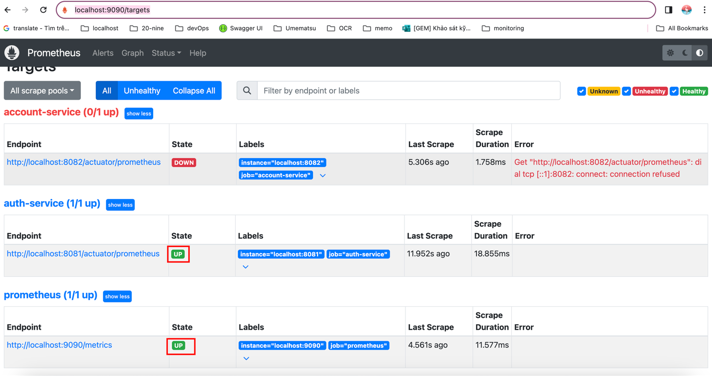

### 3. Install grafana and 

- Install grafana on macOS

  ```bash
  $ brew update
  $ brew install grafana
  ```

- Start grafana

  ```bash
  $ brew services start grafana
  ````

- Stop grafana

  ```bash
  $ brew services stop grafana
  ````

- UnInstall grafana on macOS

  ```bash
  $ brew uninstall grafana
  ```

- Open Grafana on browser: http://localhost:3000/

### 4. Visualize applications on [Grafana](http://localhost:3000/)

1. Login with default account: `admin/admin`

2. [Add datasource](http://localhost:3000/connections/datasources/new)

  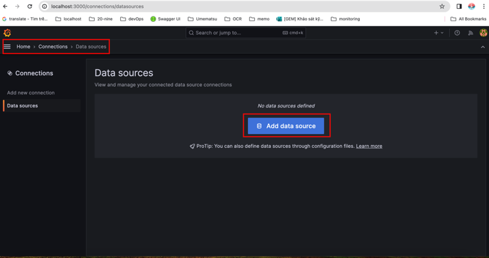
  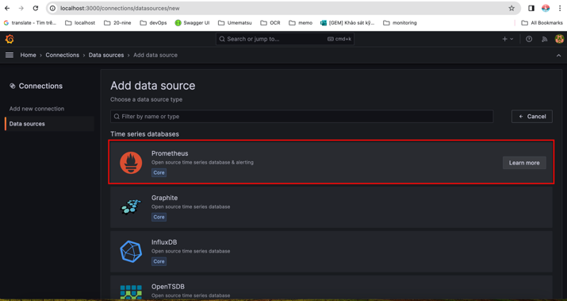
  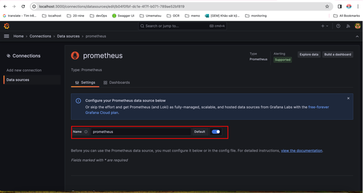
  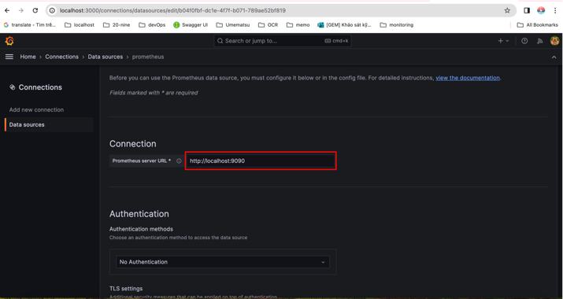
  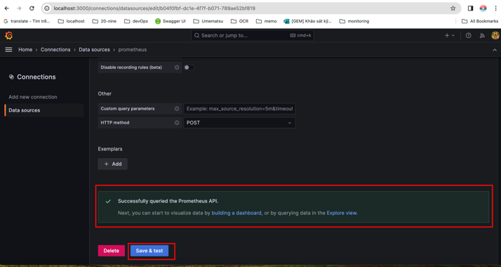

3. Add dashboard for `Datasource`

  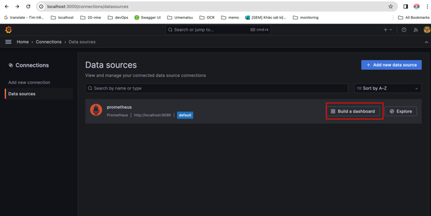
  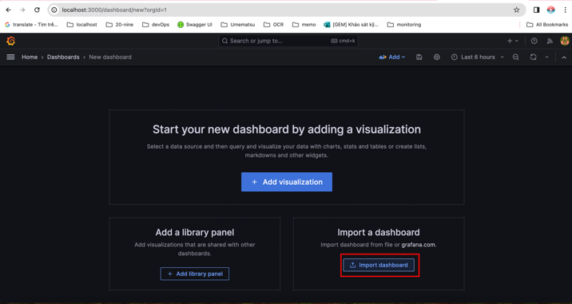
  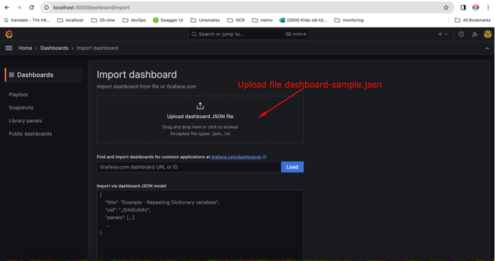
  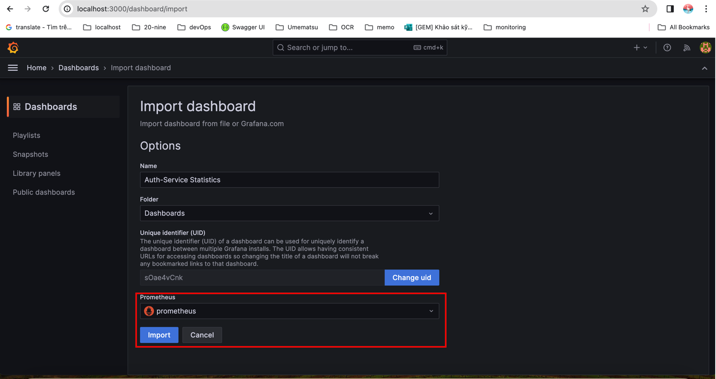
  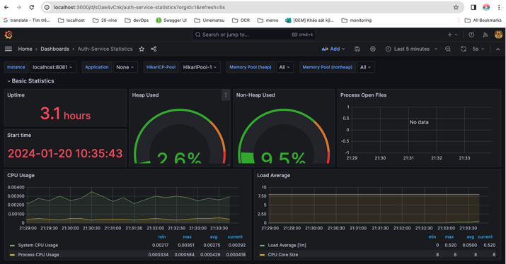
