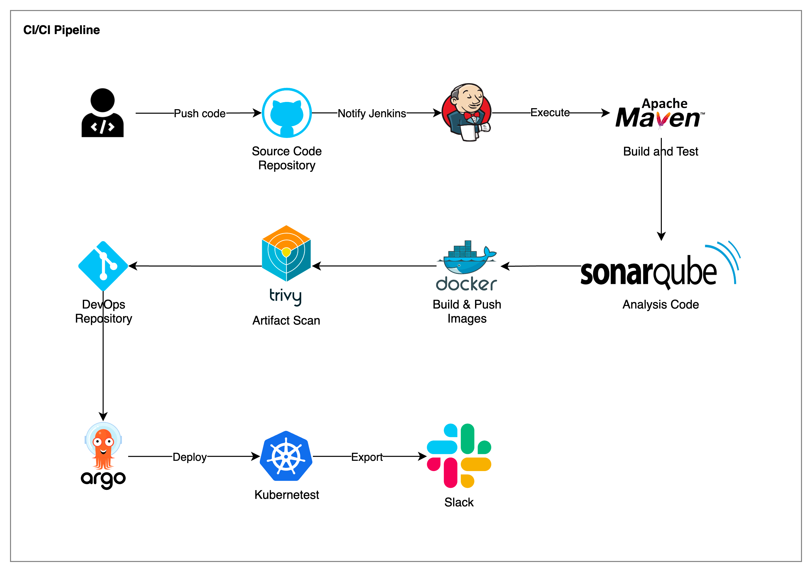
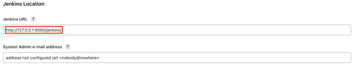
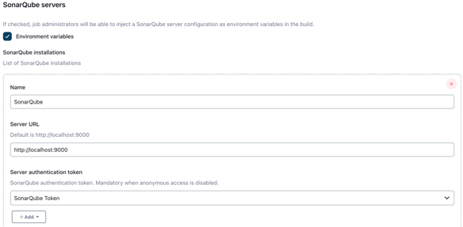
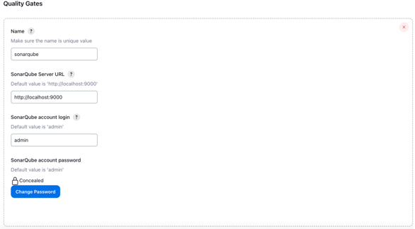
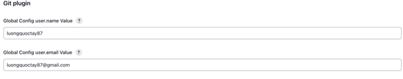
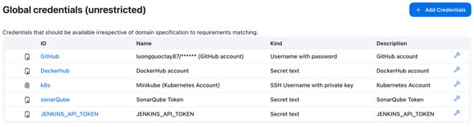
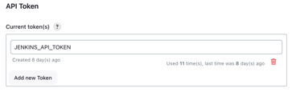

### 1. Prerequisites
- [Install Jenkins](how-to-install-jenkins-macos.md)
- [Install SonarQube locally on Mac](https://techblost.com/how-to-setup-sonarqube-locally-on-mac/)
- [Install Argo CD](https://argo-cd.readthedocs.io/en/stable/getting_started/)
### 2. System Configuration
- System:
  - Jenkins Location
    
    
  - SonarQube servers
  
    
  - Quality Gates

    
  - Git Plugin

    
- Tools:
  - JDK
  - Maven
  - Docker
  - Git
- Plugins:
  - SonarQube Scanner
  - Sonar Quality Gates
  - Quality Gates
  - Docker
  - Docker Commons
  - Docker Pipeline
  - Docker API
  - docker-build-step
  - CloudBees Docker Build and Publish
- Credentials:

  

  
### Pipelines:
  - CI Pipeline
    ```bash
    pipeline{
      agent any
      tools {
          maven 'MAVEN'
      }
      environment {
          APP_NAME = "auth-service"
          RELEASE = "1.0.0"
          DOCKER_USER = "luongquoctay87"
          DOCKER_PASS = 'Dockerhub'
          IMAGE_NAME = "${DOCKER_USER}" + "/" + "${APP_NAME}"
          IMAGE_TAG = "${RELEASE}-${BUILD_NUMBER}"
          JENKINS_API_TOKEN = credentials('JENKINS_API_TOKEN')
      }
      stages {
          stage ('Clean workspace') {
              steps {
                  cleanWs()
              }
          }
    
          stage("Checkout from SCM"){
              steps {
                  git branch: 'master', credentialsId: 'GitHub', url: 'https://github.com/luongquoctay87/authentication'
              }
          }
    
          stage("Build Application"){
              steps {
                  sh "mvn clean package"
              }
          }
    
          stage("Test Application"){
              steps {
                  sh "mvn test"
              }
          }
    
          stage("Sonarqube Analysis") {
              steps {
                  script {
                      withSonarQubeEnv(credentialsId: 'sonarQube') {
                          sh "mvn sonar:sonar"
                      }
                  }
              }
          }
    
          stage("Quality Gate") {
              steps {
                  script {
                      waitForQualityGate abortPipeline: false, credentialsId: 'sonarQube'
                  }
              }
          }
    
          stage("Build & Push Docker Image") {
              steps {
                  script {
                      withCredentials([string(credentialsId: 'Dockerhub', variable: 'dockerhub_pwd')]) {
                          docker_image = docker.build "${IMAGE_NAME}"
                          docker_image.push("${IMAGE_TAG}")
                          docker_image.push('latest')
                      }
                  }
              }
          }
    
          stage("Trivy Scan") {
              steps {
                  script {
                      sh ('docker run -v /var/run/docker.sock:/var/run/docker.sock aquasec/trivy image ${IMAGE_NAME}:latest --no-progress --scanners vuln  --exit-code 0 --severity HIGH,CRITICAL --format table')
                  }
              }
          }
    
          stage("Trigger CD Pipeline") {
              steps {
                  script {
                      sh "curl -v -k --user jenkins:${JENKINS_API_TOKEN} -X POST -H 'cache-control: no-cache' -H 'content-type: application/x-www-form-urlencoded' --data 'IMAGE_TAG=${IMAGE_TAG}' 'http://127.0.0.1:8080/job/auth-service-cd/buildWithParameters?token=gitops-token'"
                  }
              }
          }
    
          stage("Cleanup Artifacts") {
              steps {
                  script {
                      sh "docker rmi ${IMAGE_NAME}:${IMAGE_TAG}"
                      sh "docker rmi ${IMAGE_NAME}:latest"
                  }
              }
          }
      }
    
      // Note: Need to setting Email Notification in Jenkins-lts
      // post {
      //     failure {
      //         emailext body: '''${SCRIPT, template="groovy-html.template"}''',
      //                 subject: "${env.JOB_NAME} - Build # ${env.BUILD_NUMBER} - Failed",
      //                 mimeType: 'text/html',to: "luongquoctay87@gmail.com"
      //         }
      //      success {
      //           emailext body: '''${SCRIPT, template="groovy-html.template"}''',
      //                 subject: "${env.JOB_NAME} - Build # ${env.BUILD_NUMBER} - Successful",
      //                 mimeType: 'text/html',to: "luongquoctay87@gmail.com"
      //       }
      // }
    }
    ```

  - CI Pipeline
    ```
    pipeline{
        agent any
        environment {
            APP_NAME = "auth-service"
        }
        stages {
            stage ('Clean workspace') {
                steps {
                    cleanWs()
                }
            }
    
            stage("Checkout from SCM"){
                steps {
                    git branch: 'master', credentialsId: 'GitHub', url: 'https://github.com/luongquoctay87/gitops-cicd'
                }
            }
    
            stage("Update the deployment tag"){
                steps {
                    sh """
                        cat auth.yml
                        sed -i'' -e 's/${APP_NAME}:.*/${APP_NAME}:${IMAGE_TAG}/g' auth.yml
                        cat auth.yml
                    """
                }
            }
    
            stage("Push the changed deployment file to git"){
                steps {
                    sh """
                        git config --global user.name 'luongquoctay87'
                        git config --global user.email 'luongquoctay87@gmail.com'
                        git add auth.yml
                        git commit -m 'Update deployment image tag ${APP_NAME}:${IMAGE_TAG}'
                    """
                    withCredentials([gitUsernamePassword(credentialsId: 'GitHub', gitToolName: 'Default')]) {
                        sh 'git push https://github.com/luongquoctay87/gitops-cicd master'
                    }
                }
            }
        }
    }
    ```

---
Reference sources:
- [Kubernetes CI/CD Pipeline Using Jenkins](https://www.youtube.com/watch?v=q4g7KJdFSn0&t=4624s)
- [Real Time DevOps Project | Deploy to Kubernetes Using Jenkins | End to End DevOps Project | CICD](https://www.youtube.com/watch?v=e42hIYkvxoQ)
- [Setting Up Jenkins Pipeline for a Spring Boot App](https://howtodoinjava.com/devops/setup-jenkins-pipeline-for-spring-boot-app/)
- [Jenkins Tutorials Overview](https://www.jenkins.io/doc/tutorials/#tools)
- [How to Setup Docker in Jenkins on Mac](https://harshityadav95.medium.com/how-to-setup-docker-in-jenkins-on-mac-c45fe02f91c5)
- [How to setup EKS Cluster & Deploy Springboot Microservices into EKS using Helm and Jenkins Pipeline](https://www.youtube.com/watch?v=Ojb9Rh0BcvA)