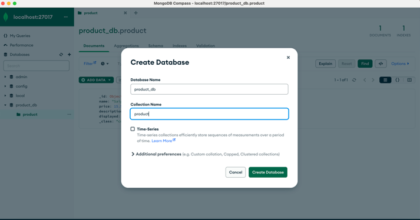

### 1. Install Mongodb on macOS

- [Download MongoDB Community Server](https://www.mongodb.com/try/download/community)
  ```bash
  $ wget https://fastdl.mongodb.org/osx/mongodb-macos-arm64-7.0.5.tgz
  ```

- Unzip file `mongodb-macos-arm64-7.0.5.tgz`
  ```bash
  $ tar -xzf mongodb-macos-arm64-7.0.5.tgz
  ```

- Copy folder unzip folder `mongodb-macos-aarch64-7.0.5/bin/*` to directory `/usr/local/bin/`
  ```bash
  - $ sudo cp mongodb-macos-aarch64-7.0.5/bin/* /usr/local/bin/
  ```

- Navigate to `home` directory
  ```bash
  $ cd ~
  ```

- Create `data` and `log` directories
  ```bash
  $ sudo mkdir -p ~/data/db
  $ sudo mkdir -p ~/data/log/mongodb
  $ sudo chown $USER ~/data/db
  $ sudo chown $USER ~/data/log/mongodb
  ```

- Run `mongod` process with specific parameters  to start MongoDB
  ```bash
  $ mongod --dbpath ~/data/db --logpath ~/data/log/mongodb/mongo.log --fork
  ```

- Check MongoDB status:
  ```bash
  $ ps aux | grep -v grep | grep mongod
  tayluong         19090   0.2  0.3 411919392  54848   ??  S     5:06PM   0:50.91 mongod --dbpath /Users/tayluong/data/db --logpath /Users/tayluong/data/log/mongodb/mongo.log --fork 
  ```

- Stop mongodb:
  ```bash
  $ kill 19090 # kill the process `19090` above
  ```
  or
  ```bash
  $ mongosh
  $ use admin
  $ db.shutdownServer();
  ```

### 2. Install Mongodb on docker
```docker
version: '3.9'

services:

  mongo_db:
    container_name: mongodb
    image: "mongo:4.4.3"
    restart: always
    ports:
      - "27017:27017"
```

### 3. Working with MongoDB via MongoDB Compass

- Install MongoDB Compass
  ```bash
  $ brew install --cask mongodb-compass
  ```

- Open MongoDB Compass and create new connection

  

---
References: 
- [How to Install MongoDB on macOS Locally in 2023](https://medium.com/@minoffline/how-to-install-mongodb-on-macos-locally-in-2023-ab84140ae595)
- [Install MongoDB Community Edition on macOS](https://www.mongodb.com/docs/v4.0/tutorial/install-mongodb-on-os-x/)


